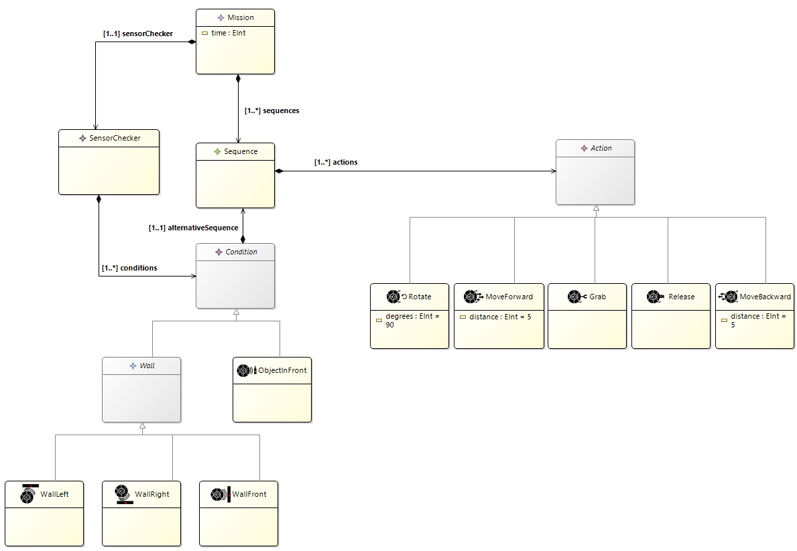

# polyCreate

IRobot Create Behavioural Language Engineering

# Cyberbotics

[IRobot's Create](https://cyberbotics.com/doc/guide/create)

# Hierarchy

- fr.univcotedazur.webots.polycreate : contient la syntaxe abastraite
- fr.univcotedazur.webots.polycreate.edit/icons : contient les icones de la syntaxe abstraite
- fr.univcotedazur.webots.polycreate.rewritingrules : contient les rewritingrules (les aspects dans le fichier .xtend)
- fr.univcotedazur.webots.polycreate.xdsml : contient le fichier .dsl qui lie le .ecore (domain modele) avec le k3 (les aspects)
- runtime-PolycreateSirius : contient la partie Sirius et nos scénarios

# Initialiser l'environnement

Premièrement il faut importer dans un projet les dossiers suivants :
- fr.univcotedazur.kairos.webots.polycreate.controler 
- fr.univcotedazur.webots.polycreate 
- fr.univcotedazur.webots.polycreate.edit 
- fr.univcotedazur.webots.polycreate.editor
- fr.univcotedazur.webots.polycreate.rewritingrules
- fr.univcotedazur.webots.polycreate.xdsml

Ensuite, il faut faire une configuration "Eclipse Application" pour lancer le workbench. Nous avons développé la partie graphique sous Sirius sous le workbench car cela ne fonctionnait pas à la racine. Pour importer toute la partie Sirius, il faut importer le dossier "runtime-PolycreateSirius" dans le workbench. Dans ce dossier ce trouve deux modules :
- fr.univcotedazur.webots.polycreate.design : définit le comportement graphique via Sirius
- fr.univcotedazur.webots.polycreate.modelisation : permet de définir les scénarios à suivre par le robot

# Nos choix et fonctionnalité

## Domain model

Voici notre domain model :

Notre objet principal est une Mission. Ce dernier possède une liste de séquences qui elles même contiennent des actions. La mission contient également un objet SensorChecker. Cet objet contient une liste de conditions qui vont être executées après chaque action. Ces conditions peuvent être la vérification si un objet se trouve devant, ou si une collision survient en face, à droite ou à gauche. Si une condition est valide, on entrera alors dans une séquence alternative puis on reprendra le flot d'exécution de la séquence initiale. Cette implémentation permet par exemple d'avoir une séquence qui parcours une pièce, puis si il y a un objet on entrera dans la séquence alternative pour par exemple déplacer l'objet et nettoyer en dessous.

## Sirius

# Exemples de scénario

## Scénario 1

Le premier scénario que nous avons développé est plutôt basique. Il contient une séquence dans laquelle notre robot va se diriger vers la canette. une fois détecter, il va rentrer dans le flot alternative "Object in front" pour déplacer la canette et pour nettoyer. Il fera ensuite demi tour et se dirigera vers la bouteille qu'il va aussi déplacer. Enfin, le robot va aller dans le salon en détectant le premier mur. Il va donc entrer dans le scénario alternatif "Wall Right" et tourner à gauche. Ensuite, nous avons fait en sorte que le robot avance avec une distance de -1, pour qu'il avance tant qu'il ne trouve pas d'objet ou de mur sur son passage.

Voici la définition du modèle : 

Voici le rendu graphique : 

Voici la vidéo d'exécution : 

## Scénario 2

Le second scénario est beaucoup plus basique mais nous permet de montrer l'enchainement entre les séquences. En effet, dans ce celui-ci nous avons 2 séquences qui lance de actions. A la fin de la première séquence, le robot va automatiquement faire la seconde séquence.

Voici la définition du modèle : 

Voici le rendu graphique : 

Voici la vidéo d'exécution : 

# Debugging

Pour nous aider à débugger le projet, nous avons mis en place un système graphique indiquant sur quel step nous nous trouvons.

# Installation

- add to path :
	- C:\Users\damin\AppData\Local\Programs\Webots\lib\controller
	- C:\Users\damin\AppData\Local\Programs\Webots\msys64\mingw64\bin
	- C:\Users\damin\AppData\Local\Programs\Webots\msys64\mingw64\bin\cpp
- edit le build.properties du projet fr.univcotedazur.kairos.webots.polycreate.controler
	- remove tout ce qu'il a des .so
- edit le .classpath du projet fr.univcotedazur.kairos.webots.polycreate.controler
	- supprimer de la ligne 8 a 20 (tous les classpathentry presque)
- dans C:\Users\damin\AppData\Local\Programs\Webots\lib\controller tout copier dans dossier fr.univcotedazur.kairos.webots.polycreate.controler/webotslibs
- open gemoc > import > general > existing projects into worskapce > fr.univcotedazur.kairos.webots.polycreate.controler
- clic droit sur src > build path > sources machin
	- la on a le dossier qui devient rouge
- Si on est sous Java 8
	- dans manifest on remove java 11 et on mets java 8
	- click sur lien bleu "Update the classphath settings"
- click droit sur la racine du projet projet
	-> java build path > librairies > extends le fr.univcotedazur.kairos.webots.polycreate.controler > Native library location > Edit > workspace > webotslibs/java
