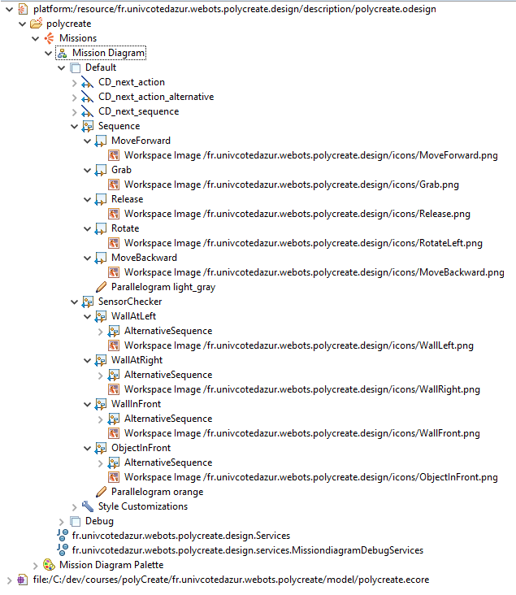
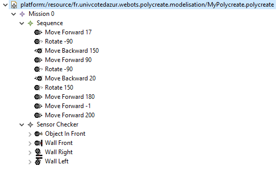
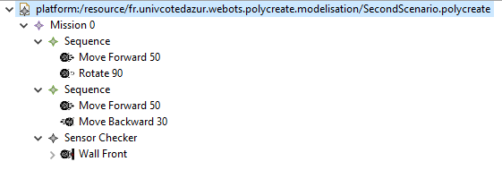
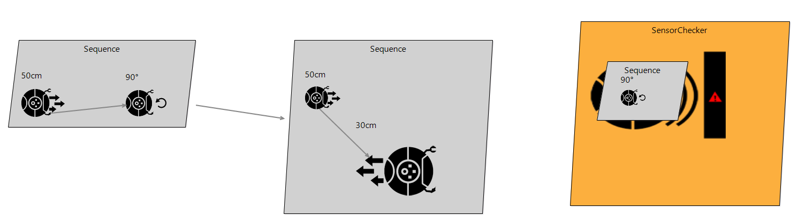

# Concrete Syntax
## Sirius

# Exemples de scénario

## Scénario 1

Le premier scénario que nous avons développé est plutôt basique. Il contient une séquence dans laquelle notre robot va se diriger vers la canette. une fois détecter, il va rentrer dans le flot alternative "Object in front" pour déplacer la canette et pour nettoyer. Il fera ensuite demi tour et se dirigera vers la bouteille qu'il va aussi déplacer. Enfin, le robot va aller dans le salon en détectant le premier mur. Il va donc entrer dans le scénario alternatif "Wall Right" et tourner à gauche. Ensuite, nous avons fait en sorte que le robot avance avec une distance de -1, pour qu'il avance tant qu'il ne trouve pas d'objet ou de mur sur son passage.

Voici la définition du modèle : 

Voici le rendu graphique : 

Voici la vidéo d'exécution : 
[Démonstration](./assets/scenario1.mp4)

## Scénario 2

Le second scénario est beaucoup plus basique mais nous permet de montrer l'enchainement entre les séquences. En effet, dans ce celui-ci nous avons 2 séquences qui lance de actions. A la fin de la première séquence, le robot va automatiquement faire la seconde séquence.

Voici la définition du modèle : 

Voici le rendu graphique : 

Voici la vidéo d'exécution : 
[Démonstration](../assets/scenario2.mp4)

# Debugging

Pour nous aider à débugger le projet, nous avons mis en place un système graphique indiquant sur quel step nous nous trouvons.

